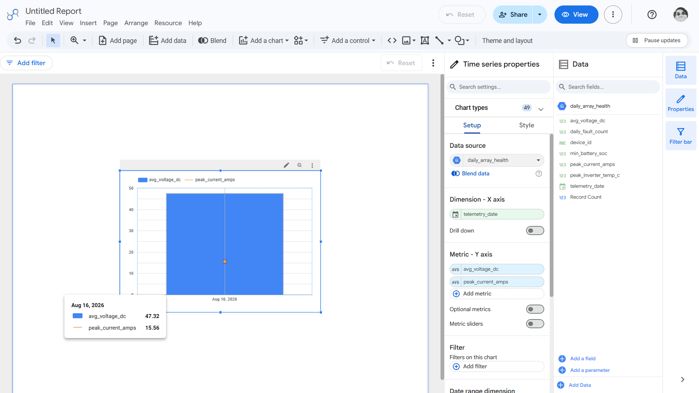

# Off-Grid Solar Telemetry Data Lake

## Architecture Overview
This repository contains a production-grade, end-to-end ELT data pipeline simulating an off-grid solar array network. It extracts high-frequency edge telemetry, loads it into a cloud data warehouse, and transforms it into aggregated hardware health metrics.

## The Tech Stack
* **Infrastructure as Code:** Terraform
* **Data Ingestion:** Python (Edge Simulator)
* **Data Warehouse:** Google BigQuery
* **Data Transformation:** dbt (Data Build Tool)
* **Orchestration:** Mage AI
* **Event Streaming (Future Phase):** Apache Kafka & PySpark

## Execution Roadmap
* [x] **Phase 1: Cloud Infrastructure & Storage** (Provisioned BigQuery via Terraform)
* [x] **Phase 2: Analytics Engineering** (Built modular AC/DC aggregation models in dbt)
* [ ] **Phase 3: Orchestration** (Automating the DAG in Mage)
* [ ] **Phase 4: Distributed Compute** (Kafka/PySpark integration)

## Certifications
* **[dbt Fundamentals Certification](https://credentials.getdbt.com/a3c1b121-55d5-4acb-91f6-425e37ec5bfa)** - Issued by dbt Labs
*This project utilizes dbt best practices (modular SQL, version control, and testing) validated by the official dbt Fundamentals credential.*

## System Telemetry Monitor
Below is the live Looker Studio dashboard connected to the BigQuery data warehouse, monitoring the daily AC power aggregations and hardware faults of the simulated off-grid solar array.

Welcome to your new dbt project!

### Using the starter project

Try running the following commands:
- dbt run
- dbt test

### Resources:
- Learn more about dbt [in the docs](https://docs.getdbt.com/docs/introduction)
- Check out [Discourse](https://discourse.getdbt.com/) for commonly asked questions and answers
- Join the [chat](https://community.getdbt.com/) on Slack for live discussions and support
- Find [dbt events](https://events.getdbt.com) near you
- Check out [the blog](https://blog.getdbt.com/) for the latest news on dbt's development and best practices
