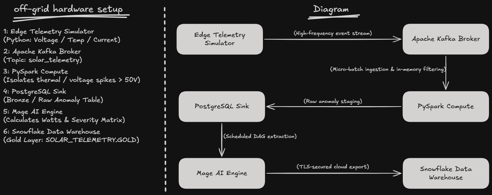
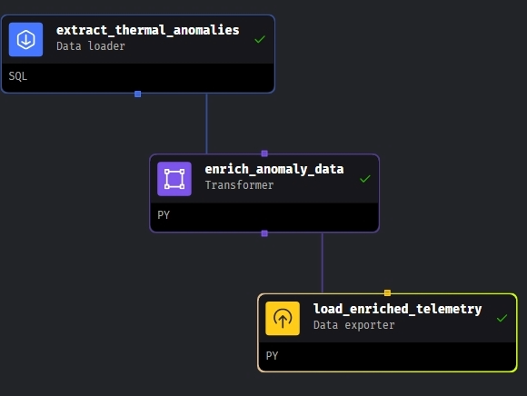
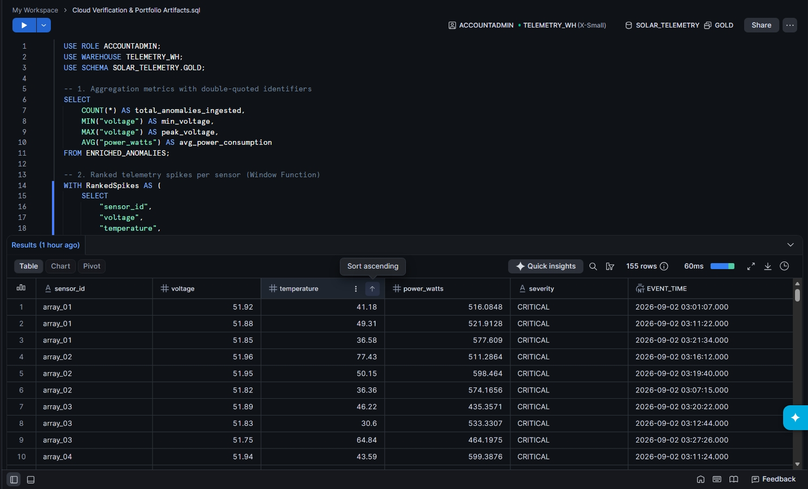

# Fault-Tolerant IoT Solar Telemetry & Cloud Warehouse Pipeline



## Architecture Overview
An enterprise-grade, distributed streaming data pipeline engineered to ingest high-frequency edge IoT telemetry, filter electrical hardware anomalies in-memory, and synchronize analytics-ready datasets into an enterprise cloud data warehouse.

Designed to operate under edge infrastructure constraints (such as intermittent network connectivity and power instability) by utilizing asynchronous message brokering, decoupled distributed compute, and idempotent warehouse loading.

---

## Technical Stack

| Layer | Technology | Function |
| :--- | :--- | :--- |
| **Edge Ingestion** | Python | Simulates multi-sensor solar array metrics (voltage, current, temperature). |
| **Message Broker** | Apache Kafka | Asynchronous event buffering and stream decoupling via topic `solar_telemetry`. |
| **Distributed Compute** | PySpark (Structured Streaming) | In-memory micro-batch filtering, schema enforcement, and anomaly extraction (> 50.0V). |
| **Bronze Operational Store** | PostgreSQL (Dockerized) | Staging layer for filtered raw anomalies and operational time-series metrics. |
| **Orchestration** | Mage AI | Scheduled DAG extraction, metric enrichment ($P = V \times I$), and cloud dispatch. |
| **Cloud Data Warehouse** | Snowflake (`TELEMETRY_WH`) | Gold layer storage (`SOLAR_TELEMETRY.GOLD`) with automated compute suspension. |
| **Observability** | Grafana | Real-time time-series SCADA dashboard monitoring edge inverter voltage swings. |

---

## Data Pipeline Lifecycle

```text
[Edge Telemetry Simulator] ──> [Apache Kafka Broker] ──> [PySpark Compute Engine]
                                                                  │
                                                                  ▼
[Grafana SCADA Dashboard] <── [PostgreSQL Bronze Store] <─────────┘
                                      │
                                      ▼ (Batch Extraction)
                              [Mage AI Orchestrator]
                                      │
                                      ▼ (TLS Egress / Idempotent Write)
                           [Snowflake Gold Warehouse]
```

1. **Edge Simulator (`kafka-streaming/`)**: Transmits high-frequency solar telemetry (voltage, current, temperature, and Unix epoch timestamps) to Apache Kafka topic `solar_telemetry`.
2. **Distributed Stream Filtering (PySpark)**: Reads streaming micro-batches, validates JSON schema typing, and isolates critical hardware anomalies (voltage exceeding 50.0V baseline) entirely in distributed memory.
3. **Bronze Staging (PostgreSQL)**: Persists raw anomalous events into a containerized relational database to maintain an operational layer.
4. **SCADA Observability (Grafana)**: Queries the operational PostgreSQL instance directly to display real-time sensor activity and voltage fluctuations.
5. **Orchestration & Metric Enrichment (Mage AI)**: Executes scheduled DAG runs (`extract_thermal_anomalies` → `enrich_anomaly_data` → `load_enriched_telemetry`) to calculate true electrical power ($P = V \times I$), normalize event timestamps, and classify fault severities (`CRITICAL`, `HIGH`, `NORMAL`).
6. **Cloud Warehouse Materialization (Snowflake)**: Authenticates via TLS against Snowflake (`bw82396.ap-southeast-7.aws`), auto-resumes virtual warehouse `TELEMETRY_WH`, and performs an idempotent replace into `SOLAR_TELEMETRY.GOLD.ENRICHED_ANOMALIES` to prevent duplicate records during network retries.

---

## Cloud Warehouse Execution & Proof of Work

### Mage AI Directed Acyclic Graph (DAG)
The three-stage orchestration pipeline executing scheduled extraction, mathematical transformation, and cloud loading:


### Snowflake Gold Layer Verification
Verified data materialization inside Snowflake Snowsight, demonstrating active compute usage and schema mapping:


---

## Analytical SQL (Snowflake Gold Layer)

```sql
USE ROLE ACCOUNTADMIN;
USE WAREHOUSE TELEMETRY_WH;
USE SCHEMA SOLAR_TELEMETRY.GOLD;

-- Calculate rolling sensor baseline and rank peak voltage spikes
WITH TelemetryMetrics AS (
    SELECT
        "sensor_id",
        "voltage",
        "temperature",
        "power_watts",
        "severity",
        TO_TIMESTAMP_NTZ("timestamp") AS event_time,
        AVG("voltage") OVER (
            PARTITION BY "sensor_id" 
            ORDER BY "timestamp" 
            ROWS BETWEEN 5 PRECEDING AND CURRENT ROW
        ) AS rolling_avg_voltage,
        DENSE_RANK() OVER (
            PARTITION BY "sensor_id" 
            ORDER BY "voltage" DESC
        ) AS severity_rank
    FROM ENRICHED_ANOMALIES
)
SELECT 
    "sensor_id",
    event_time,
    "voltage",
    ROUND(rolling_avg_voltage, 2) AS rolling_avg_voltage,
    "power_watts",
    "severity",
    severity_rank
FROM TelemetryMetrics
WHERE severity_rank <= 3
ORDER BY "sensor_id", severity_rank;
```

## Local Execution Instructions

### 1. Repository Setup & Secret Configuration
Clone the repository and copy the environment configuration template:

```bash
git clone [https://github.com/RemoGodsora/off-grid-solar-pipeline.git](https://github.com/RemoGodsora/off-grid-solar-pipeline.git)
cd off-grid-solar-pipeline
```

# Configure local and cloud connections from sanitized template
```bash
cp capstone_project/io_config.yaml.example capstone_project/io_config.yaml
```

## 2. Launch Local Infrastructure
Start the Kafka broker, Zookeeper, and PostgreSQL containers:

```bash
docker compose up -d
```
Initialize the Mage AI orchestrator:

```bash
cd orchestration
docker compose up -d
cd ..
```
## 3. Run Edge Streaming & Distributed Compute
Start the edge hardware telemetry producer:

```bash
python kafka-streaming/solar_simulator.py
```
Submit the streaming PySpark job in a separate terminal:

```bash
python kafka-streaming/spark_processor.py
```
## 4. Monitor Pipelines & Trigger Cloud Sync
Grafana SCADA Dashboard: Access http://localhost:3000 to monitor live time-series voltage fluctuations.

Mage AI Orchestrator: Access http://localhost:6789 to monitor DAG execution and trigger the cloud export to Snowflake.

### 5. In-Warehouse Transformation & Data Quality (dbt)
The analytical layer transforms raw ingestion data into production-ready dimensional marts inside Snowflake:

```bash
cd transformations/solar_analytics

# Copy sanitized profile template and populate Snowflake credentials
cp profiles.yml.example profiles.yml

# Execute transformations and data quality test suite
dbt run
dbt test
```
- **Staging** (stg_solar_telemetry): Enforces strict typing, normalizes timestamps (to_timestamp_ntz), and handles column quoting for warehouse compatibility.

- **Fact Mart** (fct_hardware_faults): Calculates 5-event rolling voltage averages (avg() over (partition by ...)), assigns severity ranks, and flags critical threshold breaches (is_critical_overvoltage).

- **Automated Data Quality:** Enforces not_null assertions and accepted_values domain constraints across primary keys and analytical flags.